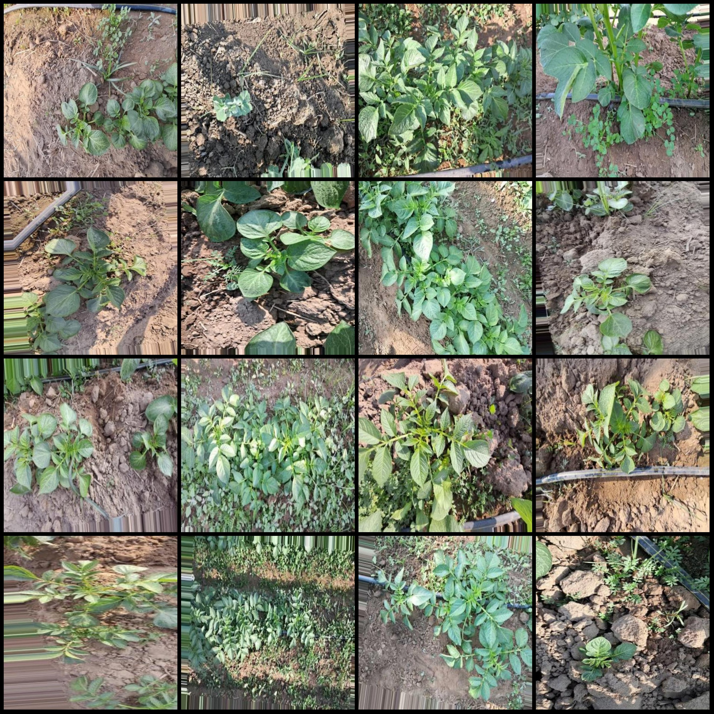
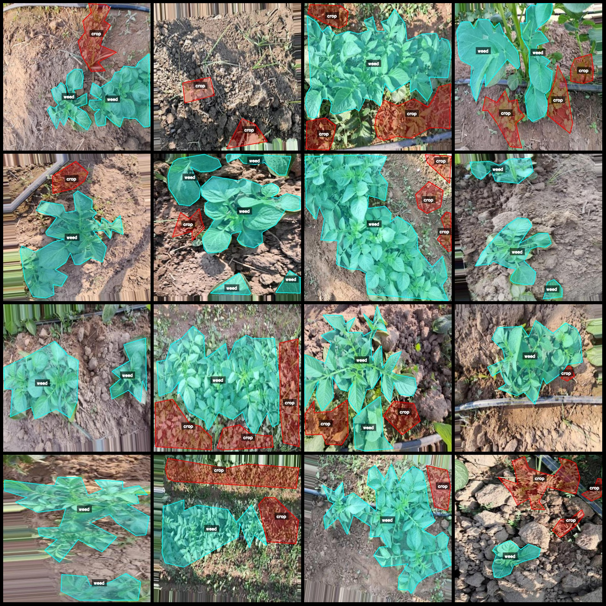
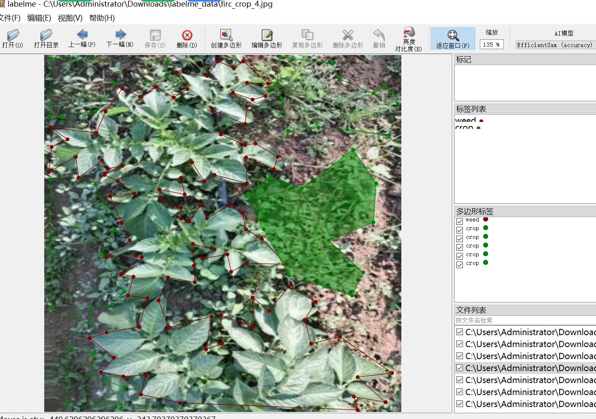

# Drone-View Smart Agriculture Field Crop and Weed Identification and Segmentation Dataset (LabelMe Format, 1359 Images in 2 Classes)

**Dataset Format:** LabelMe format (without mask files, only containing JPG images and corresponding JSON files)

**Image Count:** 1359 JPG files

**Annotation Count:** 1359 JSON files

**Number of Annotation Categories:** 2

**Annotation Category Names:** ["weed", "crop"]

**Total Boxes Count:** 4112

**Using Annotation Tool:** labelme=5.5.0

**Image Resolution:** 640x640

**Drone:** DJI MAVIC 3

**Collection Height:** 1-2m

**Collection Angle:** 90°

**Annotation Rules:** Polygon is drawn around the category for each image.

**Important Notice:** The dataset can be opened and edited with LabelMe; the JSON dataset needs to be converted into either Yolo or Coco format for semantic segmentation or instance segmentation.

**Special Declaration:** This dataset does not guarantee the accuracy of the model or weight files trained on it.

**Image Preview:**

**Annotation Example:**

**Annotation Drawing Results:**

[Image example with manual annotation](annotation_example.png)

**LabelMe Editing Image Example:**

## Image

Here is a pay link on Stripe ( https://buy.stripe.com/3cs8yP7sY87d0vu9AB ). Please contact me lonlonago@foxmail.com after funding $89, and I will send you a complete data files , thank you!

